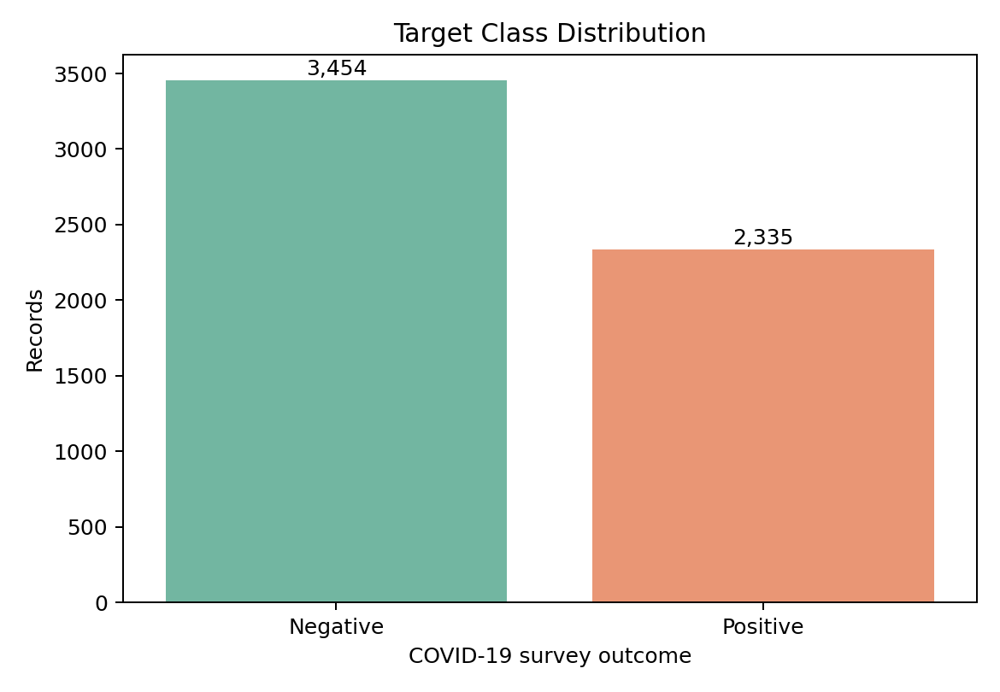
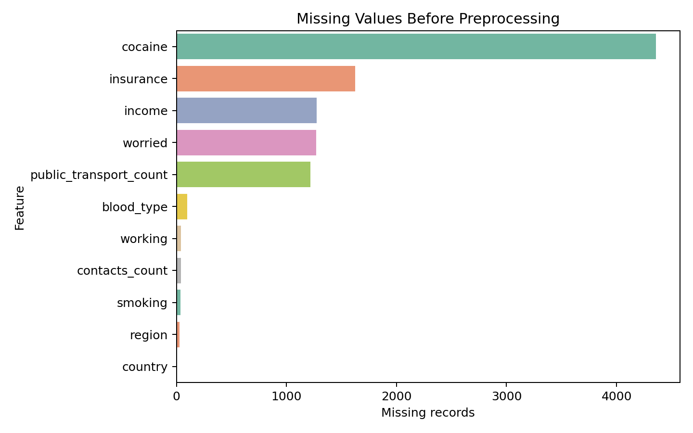
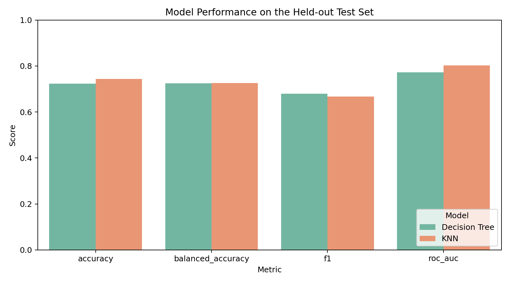
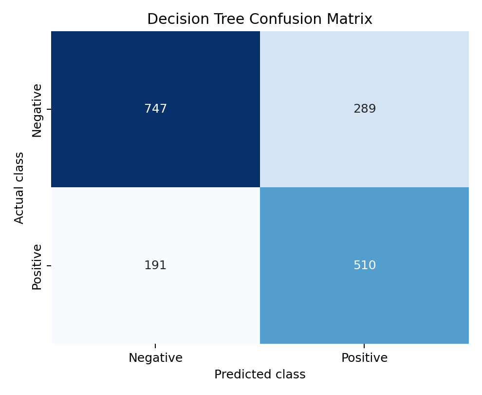

# COVID-19 Survey Outcome Classification with Python

## Overview

This project develops and compares supervised machine-learning models for classifying a binary COVID-19 survey outcome. It demonstrates an end-to-end workflow covering data quality assessment, privacy-aware feature selection, leakage-safe preprocessing, hyperparameter tuning, and evaluation on a held-out test set.

The dataset contains 5,789 survey records and was supplied by Queensland University of Technology (QUT) for an IFN509 team assessment. This repository is a portfolio-focused reorganisation of that work. It is an educational analysis and is not a clinical diagnostic tool.

## Project Objectives

- Assess missing values, invalid placeholders, and class balance.
- Exclude direct identifiers, precise coordinates, and precomputed risk scores.
- Build reproducible preprocessing pipelines for numeric and categorical features.
- Compare Decision Tree and K-Nearest Neighbours (KNN) classifiers.
- Tune models with stratified cross-validation and evaluate them on unseen data.

## Dataset

The target variable is `covid19_positive`:

- Negative records: 3,454
- Positive records: 2,335
- Positive class rate: 40.3%

The original course dataset is not redistributed because no public redistribution licence was provided. See [`data/README.md`](data/README.md) for authorised reproduction instructions.



## Data Preparation

The revised workflow addresses two important modelling risks in the original assessment notebook:

1. Preprocessing is fitted only on training folds through a Scikit-learn `Pipeline`, preventing information from the test set from influencing imputation, encoding, or scaling.
2. Each model is evaluated with its own prediction output, avoiding accidental reuse of predictions from another classifier.

The pipeline applies:

- Median imputation and standardisation to numeric features.
- Most-frequent imputation and one-hot encoding to categorical features.
- A stratified 70/30 train-test split with a fixed random state.
- Five-fold stratified cross-validation using positive-class F1 as the tuning metric.

`Participant_ID`, precise location fields, survey date, and the precomputed `risk_infection`, `risk_infection_level`, and `risk_mortality` fields are excluded. This reduces privacy risk and prevents derived risk scores from acting as target proxies.



## Model Results

| Model | Accuracy | Balanced accuracy | Precision | Recall | F1 | ROC-AUC |
|---|---:|---:|---:|---:|---:|---:|
| Decision Tree | 0.724 | 0.724 | 0.638 | 0.728 | **0.680** | 0.773 |
| KNN | **0.744** | **0.726** | **0.704** | 0.633 | 0.667 | **0.803** |

The Decision Tree produced the stronger positive-class recall and F1 score, while KNN achieved higher accuracy, precision, and ROC-AUC. The Decision Tree is retained as the primary demonstration model because it better identified positive records and offers clearer interpretation. The result also shows why model selection should not rely on accuracy alone.



### Decision Tree Error Profile

The tuned Decision Tree correctly classified 747 negative and 510 positive test records. It produced 289 false positives and 191 false negatives.



Best cross-validated Decision Tree settings:

```text
criterion = entropy
max_depth = 5
min_samples_leaf = 20
class_weight = balanced
```

## Repository Structure

```text
.
|-- data/
|   `-- README.md
|-- figures/
|   |-- decision_tree_confusion_matrix.png
|   |-- missing_values.png
|   |-- model_comparison.png
|   `-- target_distribution.png
|-- results/
|   |-- best_parameters.json
|   |-- data_summary.json
|   `-- model_metrics.csv
|-- src/
|   `-- train_models.py
|-- .gitignore
|-- README.md
`-- requirements.txt
```

## Reproduce the Analysis

With authorised access to the course dataset:

```bash
python -m venv .venv
python -m pip install -r requirements.txt
python src/train_models.py --data data/Dataset.csv
```

The command regenerates all figures and result files used in this README.

## Tools

- Python
- Pandas and NumPy
- Scikit-learn
- Matplotlib and Seaborn

## Limitations and Responsible Use

- The data is course-provided and its sampling process is not documented publicly, so the results should not be generalised to a population.
- Survey responses may contain reporting and selection bias.
- The models estimate patterns in this dataset only and must not be used for diagnosis, treatment, or individual health decisions.
- Performance was measured on one held-out split; external validation was not available.

## Project Context and Contribution

The original assessment was completed as a team project. My contributions included data cleaning, missing-value handling, exploratory analysis, feature preparation, visualisation, and supporting written analysis. This portfolio version reorganises the workflow, corrects evaluation issues, adds leakage-safe pipelines, and reports reproducible model comparisons.

The original assessment received a High Distinction (22.25/25).

## Licence

The code is available under the MIT License. The licence does not apply to the course dataset, which is not included in this repository.
